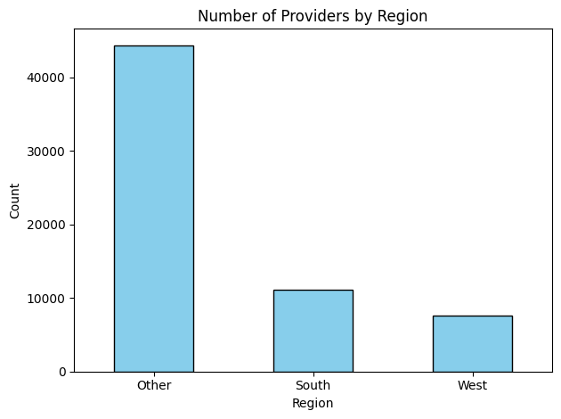
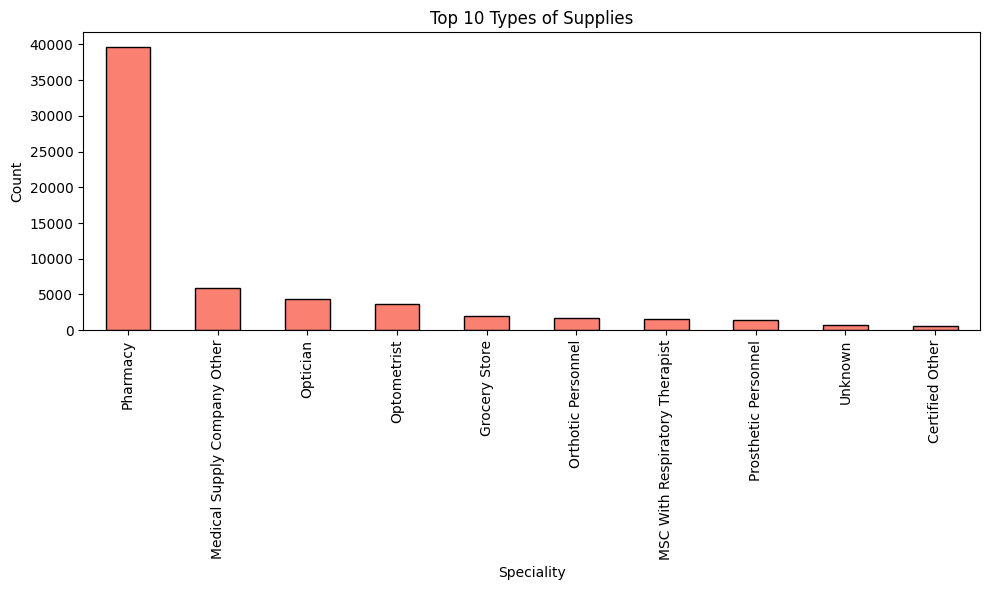

# Data Management Project (Excel + Python)

This project demonstrates a structured approach to cleaning, wrangling, and analyzing large-scale medical supplier data using a hybrid workflow of **Excel** and **Python**. It reflects real-world tasks in data quality management, master data maintenance, and reporting — with a focus on precision, reproducibility, and clarity in handling structured datasets.


---

## Project Overview

- **Dataset**: Medical Equipment Supplier dataset with 63,000+ rows and 17 columns
- **Goal**: Simulate realistic tasks of a medical data administrator:
  - Master data cleaning & standardization
  - Structured data wrangling & enrichment
  - Cleaning and Reporting the Sample date with Excel formulas
  - Visualization for stakeholder insight
- **Tools Used**:
  - Excel (manual cleaning, formulas, conditional logic)
  - Python (pandas, matplotlib)
  - Jupyter Notebooks

---

## Repo Structure

```bash
medical-supplier-data-management-excel-python
├── data/
│   ├── raw/                            #original dataset
│   │   └── Medical-Equipment-Suppliers.csv
│   └── processed/                     #processed datasets
│       ├── medical_supplier_enhanced.xlsx
│       ├── medical_supplier_sample_preprocessed.xlsx
│       └── medical_suppliers_wrangled.csv
│
├── notebooks/
│   ├── prepare_dataset.ipynb          #for creating the sample dataset with corruption
│   ├── data_preprocessing_showcase.ipynb  #full dataset cleaning walkthrough
│   ├── data_wrangling_showcase.ipynb      #data wrangilg, derived columns, categorization etc
│   └── data_visualization_showcase.ipynb  #clean, business-friendly plots
│
├── formula_summary.md                 #Excel formulas used (Austrian Excel)
└── README.md                          
```

---

## Key Components & Contributions

### 1. **create_sample_dataset.ipynb**
- Sampled 1000 rows from California region
- Injected missing values, casing issues, typos
- Created: `medical_supplier_enhanced.xlsx`

### 2. **Excel Manual Cleaning (`medical_supplier_sample.xlsx`)**
- Used:
  - Created `expiry_status`, formatted prices, applied conditional logic
  - Applied `=UPPER()` for state standardization
  - Used `=IF(TODAY() + 90 >= ...)` to flag soon-to-expire entries
  - Manual filtering and replacement of blanks or inconsistencies
  - Applied value formatting (currency, text, phone)
  - Repaired names, phone numbers, and standardized fields
  - Final cleaned file saved as: `medical_supplier_sample_preprocessed.xlsx`

**Cleaning process was recorded and shared on YouTube**  
[Watch the full Excel cleaning walkthrough](https://www.youtube.com/watch?v=ETS3sLfkHCg&t=16s)

### 3. **basic_preprocessing_for_data_wrangling.ipynb**
- Inspected 63k+ row dataset
- Cleaned sparse columns, nulls and types from full dataset
- Standardized text fields
- Normalized data types (zip codes, phone)
- Parsed `participationbegindate` and ZIP codes
- Prepared for wrangling pipeline

### 4. **data_wrangling.ipynb**
- Derived new columns:
  - `account_age_years`
  - `first_speciality`
  - `region` (from state)
  - `data_quality_flag`
- Aggregated metrics (e.g., provider count by region)
- Simulated `price`, grouped by state
- Output: `medical_suppliers_wrangled.csv`

### 5. **data_visualization.ipynb**
- Created clean visual summaries:
  - Provider distribution by region (bar chart)
  - Account age distribution (histogram)
  - Simulated price spread (boxplot)
  - Top 10 medical specialties (bar chart with vertical labels)




---

## Project Demonstrates: 

- Ability to work with **structured, messy, real-world data**
- Comfortable using both **manual tools (Excel)** and **automated pipelines (Python)**
- Structured, repeatable logic for office-grade data responsibility
- Alignment with job descriptions focused on *data precision, cleanliness, and clarity*

---

## Next Possible Steps
- Add Excel summary dashboard or slicers
- Train an ML model to classify suppliers by risk level or specialty cluster
- Integrate basic web form to submit new supplier data with validation
- Integrate a data validation form (HTML or Streamlit)

---

## Author
**Saiful Islam**  
MSc Computer Science (Data Science), TU Graz  
[LinkedIn](https://linkedin.com/in/saifar) • [GitHub](https://github.com/saifar-tug)

---

## Aiming for Jobs such as:
- Office employee
- Data maintenance 
- Data steward / data quality analyst
- Excel-based analyst roles with structured processes
